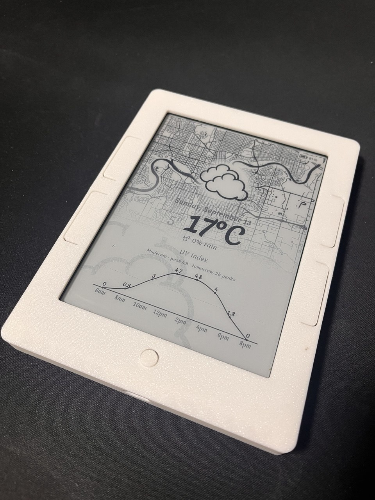

<div align="center">

# hacking_nook

**A 2011 Nook Simple Touch, turned into a wall dashboard.**

A Raspberry Pi draws the page. The Nook fetches it, displays it, and sleeps.
Local rendering and control. No subscription or weather API keys.
Weather and map data come from Open-Meteo and OpenStreetMap.



*The working build: server-rendered weather on the Nook’s e-ink display.*

</div>

---

## The hardware

<table>
<tr>
<td width="50%" align="center">
<br>
<b>Nook Simple Touch</b><br>
<sub>~$30 used · 6" e-ink, 800×600<br>Android 2.1 · weeks on a charge</sub>
</td>
<td width="50%" align="center">
<br>
<b>Raspberry Pi Zero 2 W</b><br>
<sub>512 MB RAM · draws the pages<br>Any Pi works; this is the tight case</sub>
</td>
</tr>
</table>

> The hardware comparison uses stock photographs; the main photo above is our build. Credits below.

## The pages

Four weather wallpapers, selected on the server. Enable the ones you want and
set their start times in the web dashboard. These are the default times:

<table>
<tr>
<td align="center"><br><b>today</b><br><sub>09:30 – 17:00</sub></td>
<td align="center"><br><b>hourly</b><br><sub>06:00 – 09:30</sub></td>
<td align="center"><br><b>daily</b><br><sub>17:00 – 21:00</sub></td>
<td align="center"><br><b>tomorrow</b><br><sub>21:00 – 06:00</sub></td>
</tr>
</table>

**If the weather is about to turn, it switches to `hourly` regardless of the
clock, when Hourly and advisories are enabled** — rain or snow starting, rain turning to snow, a thunderstorm, crossing
freezing, a big temperature swing, wind picking up. Those are the times you want
to know *when*, and `hourly` is the page that says so.

A gradual drift does not interrupt. Cloud thickening, or two degrees over six
hours, is what the day view already shows.

**Today and Tomorrow adapt their lower chart to the forecast:** precipitation,
wind, UV, or temperature. Precipitation and wind use hatched bars; UV and
temperature use smooth curves. Tomorrow summarizes daytime in two-hour peaks.
See [chart selection details](upstream/README.md#adaptive-today-and-tomorrow-charts).

## How it fits together

```text
Browser                         Raspberry Pi                       Nook
   │                            weather-cal :8082                   │
   │                              renders weather PNGs              │
   │                                      │                         │
   └── settings dashboard :8001 ──► nookpanel :8000 ◄── image fetch ──┘
       programs + schedules          selects and caches PNGs       displays,
       displayer refresh             sends refresh interval        then sleeps
```

Two services run on the Pi; the Nook does no weather fetching or page rendering.

- **weather-cal** uses [inkplate10-weather-cal](https://github.com/chrisjtwomey/inkplate10-weather-cal),
  with local patches for keyless maps, adaptive charts, and generation retries.
  HTML/CSS is rendered through headless Chromium on its hourly schedule.
- **nookpanel** checks which page to serve every five minutes by default. It
  validates incoming PNGs and caches the last good image in memory and on disk.
  Failed downloads retry after 30 seconds. With no cached image it returns 503;
  it does not substitute different artwork in renderer mode.
- **The settings dashboard**, served by the same nookpanel process on port 8001,
  saves program schedules and the device refresh interval without a restart.
- **NookPanel APK 0.2.0** fetches a picture, overlays its battery indicator,
  preserves the display as a screensaver, turns Wi-Fi off, and sleeps until an
  RTC alarm. Touch and long-press controls are disabled. Its default wake
  interval is **one hour**, independently of the server's five-minute check.

Everything restarts on boot — see [Auto-start](#auto-start) below.

## Set up the Pi

Raspberry Pi OS, any model. Tested on a Zero 2 W.

```bash
sudo apt install -y git
git clone --recurse-submodules https://github.com/INNOVETRON/hacking_nook.git ~/hacking_nook
cd ~/hacking_nook

OSM_MAP_LABEL="Edmonton" ./upstream/install-on-pi.sh   # renderer (~10 min)
./server/install-on-pi.sh                               # panel server
```

That works as-is — the example config is Edmonton, so copy-paste gives you a
running panel. **For your own city**, edit the two files and restart:

```bash
nano server/config.json          # latitude, longitude, timezone
nano upstream/run/config.yaml    # location:, timezone:
sudo systemctl restart weather-cal nookpanel
```

Check it:

```bash
journalctl -u weather-cal -f
curl -o test.png http://localhost:8000/panel.png
```

### If the install stops on the first line

```
E: dpkg was interrupted, you must manually run 'sudo dpkg --configure -a'
```

A previous apt run on that Pi was interrupted, so every `apt-get` fails until
it is repaired. The installer now runs `dpkg --configure -a` itself before
touching apt, but on an older checkout, or if it fails for another reason:

```bash
sudo dpkg --configure -a       # can take several minutes on a Zero
sudo apt-get check             # should print nothing
```

then re-run the installer. It is safe to run more than once.

> Give the Pi a **DHCP reservation**. The Nook stores its server URL; initial
> setup uses ADB, and everyday settings use the web dashboard.

### Sharing a Pi with other services

Nothing here assumes a dedicated Pi. It uses **three ports**: 8000 for image delivery,
8001 for settings, and 8082 for the renderer. The renderer has its own Python
venv; the installers also install system packages and configure swap.

```bash
ss -tlnp | grep -E ':8000|:8001|:8082'     # check they are free first
```

To move them, set `port` and `settings_port` in `server/config.json`, and `server.port` in
`upstream/run/config.yaml`, then point `renderer_url` at the new renderer port.

The one thing that is not free is **memory**. Chromium is the whole cost, and
the installer raises swap to 2 GB for it. On a 512 MB Pi already running
something substantial, expect the renderer to be slow rather than to fail —
each page takes about 40 seconds.

## Auto-start

Both installers register systemd units and enable them, so nothing needs doing
by hand. To confirm:

```bash
systemctl is-enabled weather-cal nookpanel     # both: enabled
systemctl is-active  weather-cal nookpanel     # both: active
```

If either says `disabled`:

```bash
sudo systemctl enable --now weather-cal nookpanel
```

### What happens after a power cut

| | |
|---|---|
| At startup | Pi starts both services; the proxy restores its last good cached image |
| While rendering | The Nook retains its previous picture; a first-ever empty proxy returns 503 |
| When a valid PNG is ready | The proxy updates its cache |
| At the next Nook wake | The device fetches the image and the current refresh interval |

Rendering and Wi-Fi startup take longer on smaller Pis. A restart or a temporary
outage preserves the previous artwork instead of replacing it with a fallback page.

### Wi-Fi is slower than systemd thinks

`NetworkManager-wait-online` reports the network up as soon as the link
associates — about two seconds on this Pi — which on Wi-Fi is well before DNS
resolves. The renderer geocodes your location at startup, so it used to die on
the first `Temporary failure in name resolution` and, with a long restart delay,
leave the renderer down for minutes.

The unit now waits for a name to actually resolve before starting:

[`upstream/wait-for-dns.sh`](upstream/wait-for-dns.sh) is installed as the unit's
startup check.

Bounded at two minutes, and it exits 0 either way, so a genuinely offline boot
still starts and retries rather than blocking forever.

### If it does not come back

```bash
systemctl status weather-cal nookpanel
journalctl -u weather-cal -b --no-pager | head -40    # this boot, from the top
systemd-analyze blame | head                          # what was slow
```

Do **not** `systemctl restart weather-cal` while it is mid-regeneration — two
Chromiums compete and Selenium times out at 120 s. Check for
`Starting http server` first, then `stop`, wait, `start`. Or just run
`./upstream/refresh-on-pi.sh`, which sequences it properly.

## Set up the Nook

1. **Root it** with NookManager from an SD card — [docs/02-rooting.md](docs/02-rooting.md).
   Run *Backup* from its menu before *Root*.
2. **Build and install the app.** Needs Docker on any x86_64 machine, once:
   ```bash
   (cd app && make image && make debug)
   # Press the physical wake button before uploading an update over Wi-Fi.
   adb install -r app/bin/NookPanel-debug.apk
   ```
3. **Point it at the Pi** over adb, not the touchscreen:
   ```bash
   ./tools/push-config.sh http://<pi-ip>:8000/panel.png 3600
   ```
4. It starts itself on boot and ignores touch. Open `http://<pi-ip>:8001/`
   for program schedules and displayer refresh settings. Changes arrive on the
   next fetch. `./tools/screenshot.sh out.png` captures the display.

The Android 2.1 traps — and there are several — are in
[docs/06-our-own-app.md](docs/06-our-own-app.md).

## Choose and schedule wallpapers

Open **`http://<pi-ip>:8001/`** from a browser on your LAN. No APK rebuild is
needed when you change a schedule or refresh interval.

1. The main page has one **Weather & forecast** program card with radio selection.
   This is the currently supported program.
2. Open **Program settings** to enable Hourly, Today, Daily, or Tomorrow and give
   each enabled wallpaper a unique start time. A page stays selected until the
   next start time; the last slot continues overnight. Times use the server's
   configured timezone.
3. Enable or disable weather advisory overrides. Disabled Hourly is never chosen
   by an advisory.
4. Open **Displayer options** to set the device refresh interval, from one minute
   to 24 hours. Longer intervals mean fewer wakeups and less battery use.
5. Save. The server persists settings and starts selecting the new page. The
   Nook receives changes **on its next fetch**; saving cannot wake a sleeping Nook.

The server sends `X-Nook-Refresh-Seconds` with image responses, including 503.
The APK remembers valid intervals and uses them for its next alarm. If the header
is missing or invalid, it keeps its previous interval. All Nooks using this
endpoint currently share the same displayer settings.

The dashboard is a trusted-LAN interface without a login. Keep ports 8000, 8001,
and 8082 on your local network; plain HTTP supports Android 2.1's old network stack.

## How we build a wallpaper server

The display contract is deliberately small: **serve a complete PNG over HTTP**.
Our portrait pages are 600×800, prepared for the Nook's greyscale e-ink panel.
Fonts, charts, maps, calendars, and any API calls belong on the server. The APK
only fetches, displays, and sleeps.

The current implementation separates three jobs:

| Job | Implementation |
|---|---|
| Produce wallpaper images | `upstream/`: weather-cal templates, local patches, and the Chromium renderer |
| Choose a wallpaper and preserve a good image | `server/pagechoice.py` and `server/panel_server.py` |
| Configure the program and display | `server/settings.py` and `server/dashboard.html` on port 8001 |

To connect another image renderer manually, serve its PNG on the LAN and set
`mirror_url` in `server/config.json`, removing `renderer_url` and `mirror_base` if
present. Restart `nookpanel`. The Nook keeps fetching the same `/panel.png` URL;
the proxy validates and caches the source image. This fixed-image mode is useful
for a custom wallpaper endpoint; it does not add a program card automatically.

For a future **landscape clock, calendar, or other rendering program**, add a
stable program ID and settings to the server catalog, implement its image adapter
and selection logic, and give it a separate cache identity. Publish a new image
only after validation succeeds. Orientation and layout stay in that adapter's
output, so adding a renderer does not require touch controls or layout code in
the APK. Clock/calendar program cards and a wallpaper-upload interface are
**planned, not implemented**.

Full API, persistence, and extension details: [server/README.md](server/README.md#remote-settings-and-future-programs).

| Other customization | Where |
|---|---|
| Zoom or move the weather map | `OSM_MAP_ZOOM`, `OSM_MAP_CENTER` — [upstream guide](upstream/README.md) |
| Use your own picture behind the weather | `OSM_MAP_FILE=/path/to.png` — [map image guide](upstream/README.md#using-your-own-picture-instead-of-a-map) |
| Draw the simpler built-in layouts | Remove `renderer_url`, `mirror_base`, and `mirror_url`; see [server layouts](server/README.md#layouts) |

## Layout

```
app/         NookPanel — our Android 2.1 client
server/      wallpaper selection, image cache, settings dashboard, local layouts
upstream/    weather-cal: the OSM map shim, patches, Pi installer
tools/       flash an SD card, push config, screenshot the panel
docs/        how it was built, and a full lab log
external/    upstream projects as submodules — never edited in place
```

The [lab log](docs/99-lab-log.md) records what actually happened, including the
dead ends. Start at [docs/README.md](docs/README.md).

## Third-party code and data

Nothing is vendored — upstream projects are submodules, so this repo carries
only pointers and our own code.

| What | Licence |
|---|---|
| `inkplate10-weather-cal` — run, plus patches in `upstream/patches/` | MIT, © 2023 Chris Twomey |
| `trmnl-nook-simple-touch`, `Nook-weather-NWS` — reference | MIT |
| `nook-dashboard`, `NookManager` — reference | no licence stated upstream |
| Map data in the sample images and at runtime | © OpenStreetMap contributors, [ODbL](https://www.openstreetmap.org/copyright) |
| `app/res/drawable-*/ic_launcher.png` — Android SDK template | Apache-2.0 |
| Comic Neue — installed from Debian, not vendored | SIL OFL |
| [`docs/images/nook-photo.jpg`](https://commons.wikimedia.org/wiki/File:Nook_Simple_Touch.jpg) — Tthaas | CC BY-SA 3.0 |
| [`docs/images/pi-photo.jpg`](https://commons.wikimedia.org/wiki/File:Raspberry_Pi_Zero_2_W_--_2024_--_0008.jpg) — Anil Öztas | CC BY 4.0 |

Rooting images and device backups are **not** in this repo, and must not be.
